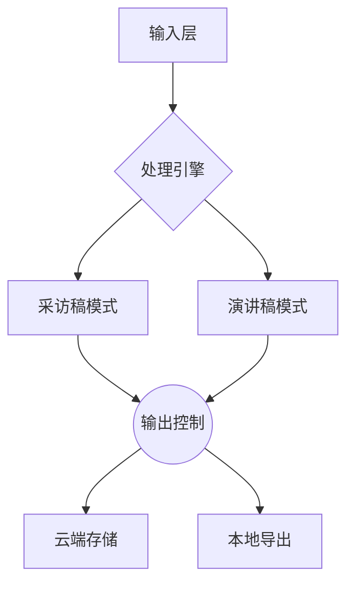
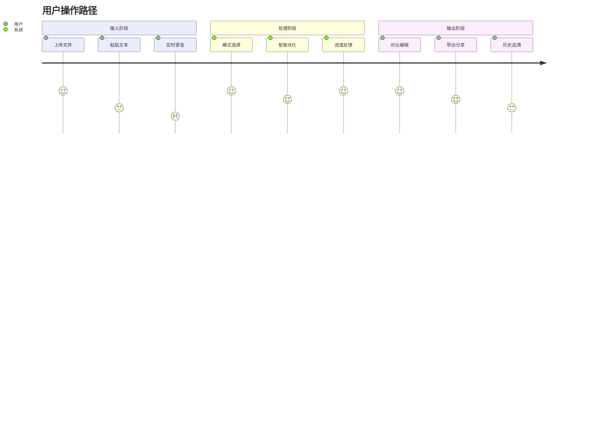

# 会议转写小助手 PRD V1.0  
应用场景：
- 会议/采访转写：会议录音语音转文字之后，对于带有时间戳、发言人的语音文字稿进行结构化转写

**设计原则**：Human Interface Guidelines + 中国红主题色系（#FF4E4E主色）

---

## 一、核心功能架构


---

## 二、交互原型设计

### 1. 输入模块（中国红#FF4E4E + 浅灰#F5F5F7）
![输入面板]
- **多模态输入**：
  - 拖拽上传区（虚线边框#FF4E4E 30%透明度）
  - 语音片段可视化时间轴（波形图采用红-黑渐变）
  - 智能粘贴板（自动识别带时间戳的文本）

- **实时标记系统**：
  ```javascript
  // 自动标记规则示例
  {
    "speaker": { 
      "pattern": "/^【(.*?)】/",
      "color": "#FF4E4E"
    },
    "timestamp": {
      "pattern": "/\\d{2}:\\d{2}/",
      "icon": "􀐫" // SF Symbols
    }
  }
  ```

### 2. 处理控制台（Dynamic Island交互范式）
![处理按钮]
- **双模式切换器**：
  - 采访稿按钮：􀈄 图标 + 中国红描边
  - 演讲稿按钮：􀓤 图标 + 深灰背景

- **智能优化开关组**：
  ```swift
  Toggle("术语标准化", isOn: $isStandardize)
    .toggleStyle(.button)
    .tint(.red)
  Toggle("情感保留", isOn: $keepEmotion)
  Toggle("智能分段", isOn: $autoParagraph)
  ```

### 3. 输出面板（卡片式布局）
![输出示例]
- **双栏对比视图**：
  ```html
  <div class="compare-view">
    <article class="original" style="border-right: 2px dashed #FF4E4E">
      <h3>原始文本</h3>
      <p>【张三】00:12 这个NCCL啊...你懂的，就是那个你扣的东西...</p>
    </article>
    <article class="processed">
      <h3>采访稿模式</h3>
      <blockquote style="border-left: 3px solid #FF4E4E">
        Q：请解释NCCL的技术价值<br>
        A：NCCL作为分布式通信库（展示NVIDIA官方架构图）...
      </blockquote>
    </article>
  </div>
  ```

---

## 三、核心技术规格

### 1. 文本处理引擎
| 模块 | 算法 | 响应时间 |
|------|------|----------|
| 口语过滤 | BERT-CRF 混合模型 | <300ms |
| 术语标准化 | 领域知识图谱匹配 | 实时 |
| 结构化生成 | GPT-4 Turbo 微调 | 1.2s/千字 |

### 2. 设计系统规范
| 组件 | 参数 | 值 |
|------|------|----|
| 圆角半径 | CornerRadius | 12px |
| 投影 | Shadow | x:0 y:4 blur:12 #00000020 |
| 动效曲线 | TimingFunction | cubic-bezier(0.25, 0.1, 0.25, 1) |

---

## 四、用户体验地图


---

## 五、技术实施方案

### 1. 前端架构
```bash
# 技术栈
├── Vue3 (Composition API)
├── Tailwind CSS (中国红色系扩展)
├── Vite
└── Web Audio API (波形可视化)
```

### 2. 特色交互
- **Dynamic Island 灵感**：
  ```javascript
  // 处理状态指示器
  const statusIndicator = new StatusHover({
    position: 'topRight',
    states: {
      processing: { icon: '􀖀', color: '#FF4E4E' },
      success: { icon: '􀆅', color: '#34C759' }
    }
  })
  ```

- **手势操作**：
  ```swift
  // 双指缩放调节文本密度
  MagnificationGesture()
    .onChanged { value in
      adjustTextDensity(scale: value.magnification)
    }
  ```

---

## 六、项目里程碑

| 阶段 | 交付物 | 时间 |
|------|--------|------|
| 设计验证 | Figma交互原型 | 2周 |
| 核心开发 | 文本处理引擎+基础UI | 4周 |
| 体验优化 | 动效系统+智能提示 | 2周 |
| 测试部署 | 压力测试+安全审计 | 2周 |

---

**附件**：  
[Figma原型链接] (密码保护)  
[技术架构图] Confluence文档  
[色值规范] #FF4E4E主色系扩展方案  
